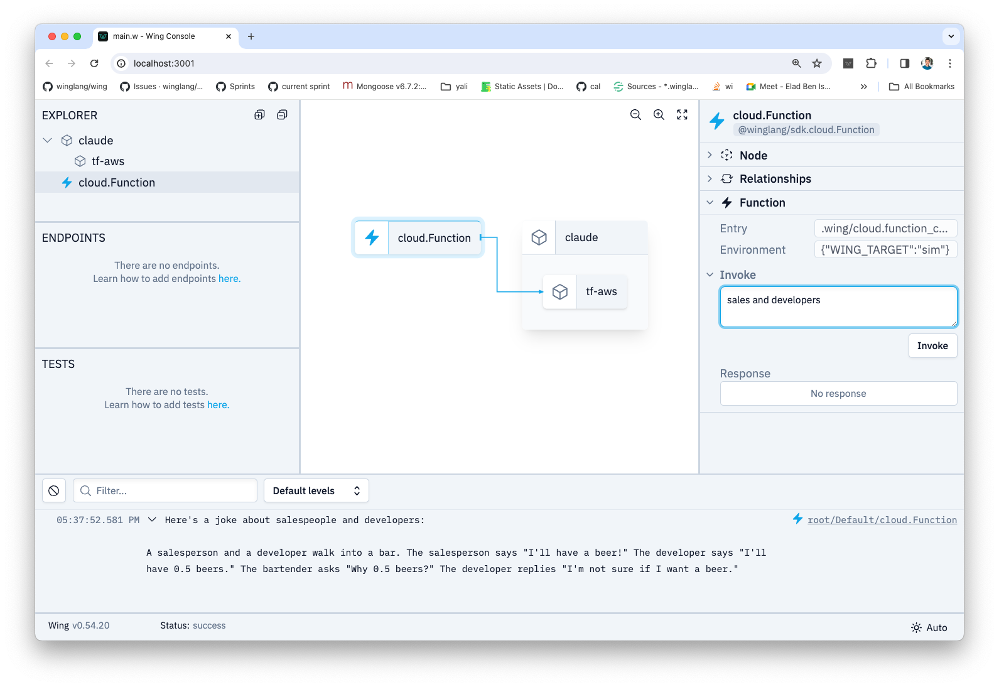

In this section, we will be installing `@winglibs/bedrock` package and 
play with it locally. 

## Create a new Project 

```sh
# Create a fresh new project
mkdir /tmp/wing-bedrock-workshop

# Create a package.json file
cd /tmp/wing-bedrock-workshop
npm init --yes
```

## Install `@winglibs/bedrock`

Install `@winglibs/bedrock`

```sh
npm install --save @winglibs/bedrock
```

## Let's use the Bedrock module 

Create the following `main.w` file

```ts
bring cloud;
bring bedrock;

let claude = new bedrock.Model("anthropic.claude-v2:1") as "claude";

new cloud.Function(inflight (topic: str) => {
  let res = claude.invoke({
    prompt: "\n\nHuman: Tell me a joke about {topic}\n\nAssistant:",
    max_tokens_to_sample: 300,
    temperature: 0.5,
    top_k: 250,
    top_p: 1,
    stop_sequences: [
      "\n\nHuman:"
    ],
    anthropic_version: "bedrock-2023-05-31"
   });
  let joke = res.get("completion").asStr();
  log(joke);
  return joke;
});
```
Run the above code:

```sh
wing run main.w
```

Now you can invoke the cloud.Function and provide it with a joke topic, using the **Invoke** button.




🚀 In the Wing Console, you can push messages to the Queue and observe the files created in the Bucket. 🚀
